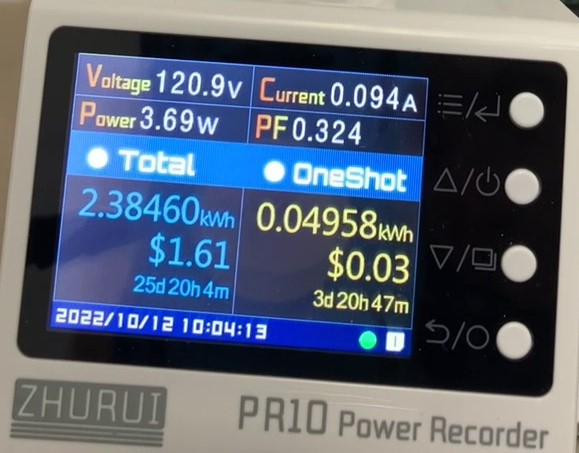

# Convert a power log video into a CSV file
Convert a video of a power monitor into a CSV file containing a frame per row and the following columns:
- Frame number
- Timestamp (seconds)
- Voltage (V)
- Current (A)
- Power (W)
- Power Factor (%)
- Total Power Usage (kWh)
- Oneshot Power Usage (kWh)
- Total Electricity Bill ($)
- Oneshot Electricity Bill ($)

## Requirements
- A ZHURUI PR10 Power Recorder which can be found [here](https://a.co/d/fwyrkhc)
  - Note: To use a different device/user interface, modify the regular expression in Step 3
- A camera to capture a video of the screen
- A Windows machine
- Install Python3 (from [here](https://www.python.org/downloads/)) and Tesseract (64-bit) (from [here](https://github.com/UB-Mannheim/tesseract/wiki))

## Usage
- Record the video and save it as `video.mp4`
- Double click on `step1_video_to_frames.bat` to generate the `frames` folder containing each frame in .jpg format
- Double click on `step2_frames_to_readtext.bat` to convert the frames into `readtext` .txt files using Tesseract
- Double click on `step3_readtext_to_csv.bat` to process the text files using a regular expression, generating `output.csv`
  - The script will skip invalid frames
- Double click on `step4_readtext_to_csv.bat` to the top and bottom X percentile of the data, generating `finalOutput.csv`
  - Repeat this step, tweaking `percentileAmount` to be as low as possible to maintain the data quality (my looking at the minimum and maximum values after running the script), and `columnsToInclude` which enumerated the columns in the data, and only considers those marked as "1".
- You will have now generated `finalOutput.csv`.

## Credits
- vfdev-5 for his interface with OpenCV2 (https://github.com/vfdev-5/Video2Frames)
  - The script has been modified to also log the timestamp of each frame
- Tesseract for their image-to-text converter
